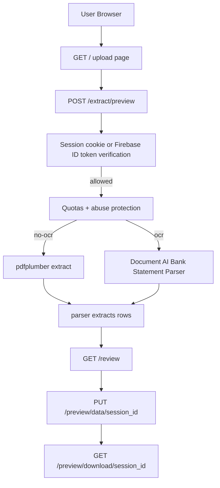

# Bank Statement To Excel (Cloud Run Web App)

Production-ready v1 web service that converts South African bank statement PDFs to Excel.

## What it does

- Accepts PDF uploads via a web UI with bank selector (FNB, Capitec Business, Capitec Personal, Standard Bank)
- Optional OCR via Google Document AI (per-bank processor support)
- Position-based column splitting using word-level x-coordinates for accurate parsing
- Interactive review page: edit cells, select/insert/delete rows, toggle PDF highlighting, synchronized vertical/horizontal scrolling, and calibrated PDF/table sync zoom
- Exports a clean `.xlsx` with bank-specific column headers

## Documentation

- Engineering docs: [`docs/engineering/README.md`](docs/engineering/README.md)
- In-app Help Center source: [`docs/help/`](docs/help/)
- UI audit and future design contract:
  - [`docs/engineering/ui-audit.md`](docs/engineering/ui-audit.md)
  - [`docs/engineering/ui-design-contract.md`](docs/engineering/ui-design-contract.md)

## Core architecture (v1)



## Security & abuse protection (critical requirements)

For v1, access must not be open to the world.

1. **Authentication (recommended/simple): Firebase Authentication**
   - Frontend signs in (Google and/or Email/Password).
   - Frontend exchanges ID token once at `POST /auth/session`.
   - Backend sets `session` + `csrf_token` cookies and verifies auth on every protected request.
   - Transitional fallback still accepts `Authorization: Bearer <Firebase ID token>`.

2. **No-key approach (because service-account keys are blocked)**
   - Backend verifies JWT using Google/Firebase public certificates.
   - This avoids needing to download/create Firebase Admin SDK JSON keys.

3. **Authorization (allowlist for launch clients)**
   - Allowlist by **email** (`ALLOWED_USER_EMAILS`).
   - Default should allow only your email until the app is proven.

4. **Rate and cost controls (must be enforced before OCR)**
   - Max file size
   - Max page count
   - Requests per minute per user
   - Pages per day per user

## Project structure

```text
app/
  main.py
  routes/
    auth.py
    upload.py
    billing.py
    admin.py
    register.py
  services/
    banks.py             # Bank parser profiles and selection
    document_ai.py
    parser.py            # Position-based multi-bank parser
    excel_export.py      # Bank-specific Excel export
  templates/
    index.html           # Upload / sign-in page
    review.html          # Interactive review with row management
    billing.html
    help.html
    register.html
    admin.html
  static/
    style.css             # Shared Swan-style app CSS
    review.css            # Review workspace CSS
    firebase-auth.js
  utils/
    files.py
requirements.txt
Procfile
```

## Google Cloud setup (manual, step-by-step)

### 1. Create/confirm the GCP project + billing

- In Google Cloud Console, select your GCP project:
  - `fnb-pdf-to-excel-prod-491212`
- Enable billing for the project.

### 2. Enable required APIs

In **APIs & Services -> Enable APIs and Services**, enable:

- Cloud Run Admin API
- Cloud Build API
- Artifact Registry API
- Document AI API

### 3. Create Artifact Registry repository (images)

- **Artifact Registry -> Repositories -> Create repository**
  - Name: `webapp-images`
  - Format: `Docker`
  - Mode: `Standard`
  - Location type: `Region`
  - Region: `africa-south1` (match Cloud Run region)
  - Encryption: default Google-managed
  - Click **Create**
- Copy the image path shown in the repo details:
  - `africa-south1-docker.pkg.dev/fnb-pdf-to-excel-prod-491212/webapp-images`
  - (this is the Artifact Registry base path for the image repository)

### 4. Create Document AI processor

- **Document AI -> Processors -> Create processor**
  - Type: **Bank Statement Parser**
  - Name: `fnb-bank-statement-parser`
  - Region: `eu`
  - Create
- Copy and use:
  - `DOCUMENTAI_PROCESSOR_ID`: `83c6261eda24a42f`
  - `DOCUMENTAI_LOCATION`: `eu`

### 5. Create and grant roles to the Cloud Run runtime service account

- **IAM & Admin -> Service Accounts -> Create**
  - Name: `cloudrun-pdf-service`
  - Email:
    - `cloudrun-pdf-service@fnb-pdf-to-excel-prod-491212.iam.gserviceaccount.com`
- Grant roles (on the GCP project):
  - `Document AI API User`
  - `Logs Writer`
  - `Secret Manager Secret Accessor` (optional now, useful later)

## Firebase Authentication setup (manual)

### 1. Create a Firebase project linked to the same GCP project

- Firebase Console -> **Create project**
- Connect to:
  - GCP project: `fnb-pdf-to-excel-prod-491212`

### 2. Enable providers

- Firebase Console -> **Authentication**
- Enable:
  - **Google**
  - **Email/Password**

### 3. Create/Invite users

- Firebase Console -> **Authentication -> Users**
- Add your client emails for allowlisting.

### 4. Copy Firebase project ID

- Firebase Console -> **Project settings**
- Copy:
  - `Project ID` (for v1: `FIREBASE_PROJECT_ID`)

## Configuration (environment variables)

Set these in Cloud Run and locally as needed:

- `GOOGLE_CLOUD_PROJECT` = `fnb-pdf-to-excel-prod-491212`
- `DOCUMENTAI_LOCATION` = `eu`
- `DOCUMENTAI_PROCESSOR_ID` = `83c6261eda24a42f`
- `FIREBASE_PROJECT_ID` = `fnb-pdf-to-excel-prod-491212`
- `BILLING_ENABLED` = `true` (enable billing/usage tracking)

Launch allowlist:

- `ALLOWED_USER_EMAILS` = comma-separated emails
  - Example: `you@example.com`
- `ADMIN_EMAILS` = comma-separated admin emails allowed to access `/admin`
  - Example: `rijff24@gmail.com`

Quotas (choose conservative values to protect Document AI usage):

- `MAX_FILE_SIZE_MB` (e.g. `10`)
- `MAX_PAGES_PER_REQUEST` (e.g. `50`)
- `MAX_REQUESTS_PER_MINUTE_PER_USER` (e.g. `10`)
- `MAX_PAGES_PER_DAY_PER_USER` (e.g. `300`)
- `REDIS_URL` (e.g. `redis://localhost:6379/0`)

Billing defaults/config:

- `DEFAULT_MONTHLY_LIMIT` (e.g. `100.00`)
- `DEFAULT_WARN_PCT` (e.g. `80`)
- `FIRESTORE_DATABASE_ID` (production uses the named Firestore database `fnb-billing`)
- `ADMIN_ERROR_TRACKING_ENABLED` (optional, default `true`)
- `BQ_BILLING_TABLE` (BigQuery billing export table for financial-truth reconciliation)
- `RECONCILIATION_TZ` (optional timezone for daily reconciliation buckets, default `Africa/Johannesburg`)
- `RECONCILIATION_ALERT_PCT` (optional variance warning threshold percent, default `15`)
- `RECONCILIATION_COLLECTION` (optional Firestore collection for daily snapshots, default `cost_reconciliation_daily`)
- Firestore collection overrides (optional):
  - `BILLING_USAGE_COLLECTION`
  - `BILLING_SETTINGS_COLLECTION`
  - `BILLING_ROLLUPS_COLLECTION`

Quota enforcement behavior:

- Quotas are enforced before any Document AI call for:
  - `POST /extract` when `enable_ocr=true`
  - `POST /extract/preview` when `enable_ocr=true`
- If Redis is unavailable, OCR requests fail closed with `503` to prevent uncontrolled spend.

Preview-first workflow:

- Uploads now go through `POST /extract/preview` first (OCR on or off).
- Users review/edit transactions, then download from the review screen.

## Local development setup

1. Install dependencies:
   - `pip install -r requirements.txt`
2. Authenticate with Google for Document AI calls locally:
   - `gcloud auth application-default login`
3. Set env vars:
   - `FIREBASE_PROJECT_ID` (required for auth)
   - `ALLOWED_USER_EMAILS` (launch allowlist)
   - `GOOGLE_CLOUD_PROJECT` (only needed when OCR is enabled)
   - `DOCUMENTAI_LOCATION` (only needed when OCR is enabled)
   - `DOCUMENTAI_PROCESSOR_ID` (only needed when OCR is enabled)
4. Run:
   - `uvicorn app.main:app --reload`

Local testing note:

- With Firebase auth enabled, browser clients should create a backend session via `POST /auth/session` after sign-in.
- API clients can still use `Authorization: Bearer <Firebase ID token>` during rollout.
- If Google sign-in fails with `auth/unauthorized-domain`, update **Firebase Console -> Authentication -> Settings -> Authorized domains** and add:
  - `http://127.0.0.1:8000`
  - `http://localhost:8000`

### Docker Compose (app + Redis)

Use Docker when you want quota/rate-limit behavior with Redis locally:

1. Set required env vars in your shell (or a `.env` file used by Compose):
   - `FIREBASE_PROJECT_ID`
   - `ALLOWED_USER_EMAILS`
   - `GOOGLE_CLOUD_PROJECT`
   - `DOCUMENTAI_LOCATION`
   - `DOCUMENTAI_PROCESSOR_ID`
2. Start containers:
   - `docker compose up --build`
3. Open app:
   - `http://127.0.0.1:8080`

Compose sets `REDIS_URL=redis://redis:6379/0` for container networking.

## Billing and usage UI

- Home page includes a compact monthly usage widget after sign-in.
- Detailed billing reports and limit settings are available at `/billing`.
- Access requests are submitted at `/register` and approved in `/admin`.
- Admin approval now auto-creates Firebase users and returns a password setup link.
- Admin panel includes cost reconciliation:
  - app-side operational estimate vs BigQuery financial truth
  - daily variance status table and alerting
  - manual refresh action via `/admin/reconciliation/run`

## Frontend Firebase Auth (npm + esbuild)

The browser signs in with Firebase, calls `POST /auth/session`, then relies on backend cookies for protected API calls.

1. Create the frontend workspace (if not already present):
   - `mkdir frontend`
   - `cd frontend`
   - `npm init -y`
2. Install dependencies:
   - `npm install firebase`
   - `npm install --save-dev esbuild`
3. Create an esbuild entry file:
   - `frontend/auth.js`
4. Bundle Firebase auth code into the backend static assets:
   - From `c:\dev\FNB_PDFtoExcel\frontend` run:
     - `npx esbuild auth.js --bundle --platform=browser --format=iife --outfile=../app/static/firebase-auth.js`
5. The built bundle is loaded by `app/templates/index.html`.

## Cloud Run deployment notes

Use the image-based flow in [`docs/engineering/deployment.md`](docs/engineering/deployment.md):

- `docker build` local image
- `docker push` to Artifact Registry
- `gcloud run deploy statement-to-excel --image ...`
- set auth + OCR + quota env vars (including `REDIS_URL`)
- deploy Firestore indexes with `firebase deploy --only firestore:indexes --project fnb-pdf-to-excel-prod-491212`; `firebase.json` targets the `fnb-billing` database
- map the public custom domain `statements.swan-computing.com` after verifying `swan-computing.com` ownership in Google Search Console

## Billing / charging path (simple, v1-safe)

In v1 the app prevents abuse with quotas and records usage per user:

- Track: user id/email, OCR enabled, pages processed, timestamps
- Export monthly totals for invoicing (CSV now; automated billing later)
- Eventually integrate plan/pricing per user (not in v1)

## Implementation status (important)

This repository includes the extraction + Excel flow and Document AI integration.
The remaining critical requirements to fully meet v1 security are:

- none (auth and OCR quota/rate-limit guards are implemented)
