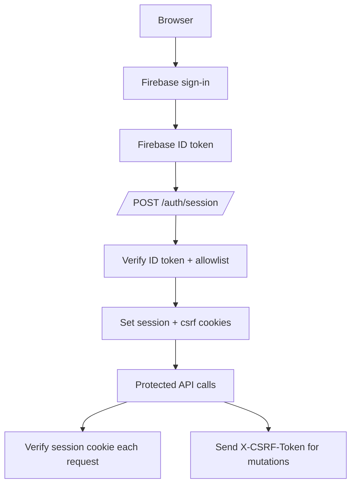

# Authentication

**File**: `app/services/auth.py`

The application uses **Firebase Authentication** for user identity and an **email allowlist** for authorization. The browser now establishes a backend-managed Firebase **session cookie** after sign-in (cookie-first), while Bearer token auth remains available during transition.

## Authentication Flow

## Token Verification Paths

### 1) Session-cookie path (primary)

- Frontend signs in with Firebase and calls `POST /auth/session` once.
- Backend verifies the ID token and issues:
  - `session` cookie: `HttpOnly`, `Secure` (prod), `SameSite`.
  - `csrf_token` cookie: readable cookie for double-submit CSRF.
- Protected endpoints verify the session cookie on every request.

### 2) Bearer path (transition fallback)

- Clients can still send `Authorization: Bearer <Firebase ID token>`.
- Backend verifies Firebase ID tokens without requiring Firebase service-account JSON keys.

## No-Key JWT Verification (Bearer path)

The backend verifies Firebase ID tokens **without** a Firebase Admin SDK service account key. Instead:

1. **Fetch public certificates**: Downloads X.509 PEM certificates from Google's `securetoken` endpoint: `https://www.googleapis.com/robot/v1/metadata/x509/securetoken@system.gserviceaccount.com`
2. **Extract public key**: Converts the X.509 certificate to a PEM public key using the `cryptography` library.
3. **Verify JWT**: Uses `PyJWT` to decode and verify the token with the RS256 algorithm.
4. **Certificate rotation**: Certificates are cached for 1 hour (`_CERTS_CACHE_TTL_SECONDS`). The backend first tries the certificate matching the token's `kid` (Key ID) header, then falls back to trying all known certificates.

## Email Allowlist

After successful JWT verification, the user's email (from the `email` claim) is checked against the `ALLOWED_USER_EMAILS` environment variable.

- **Format**: Comma-separated list of email addresses (case-insensitive).
- **Fail-closed**: If the env var is missing or empty, **all** requests are rejected.
- **403 response**: Returned if the email is not in the allowlist.

## Supported Sign-In Providers

Configured in the Firebase Console:

1. **Google Sign-In** - `signInWithPopup(auth, googleProvider)` in the browser.
2. **Email/Password** - `signInWithEmailAndPassword(auth, email, password)` in the browser.

## Environment Variables

| Variable | Required | Description |
|---|---|---|
| `FIREBASE_PROJECT_ID` | Yes | Firebase project ID for JWT `iss` validation |
| `ALLOWED_USER_EMAILS` | Yes | Comma-separated allowlist of permitted emails |

## Error Handling

| Scenario | HTTP Status | Error Message |
|---|---|---|
| Missing session cookie and missing Bearer token | 401 | Missing Authorization header or session cookie |
| Invalid/expired token or session | 401 | Invalid Firebase ID token or session cookie |
| Malformed JWT | 401 | Malformed Firebase ID token |
| Email not in allowlist | 403 | User is not allowlisted |
| Missing env vars | 500 | Missing required environment variable |

## CSRF Protection

- Mutating requests (`POST`, `PUT`, `PATCH`, `DELETE`) authenticated via session cookie must send `X-CSRF-Token`.
- Backend validates `X-CSRF-Token` against the `csrf_token` cookie (double-submit).
- During rollout, Bearer-authenticated requests are exempt from CSRF checks.

## Security Considerations

- Tokens/cookies are verified on **every** protected request.
- The allowlist is re-read from the environment on every request, so updates take effect immediately (no restart needed if using Cloud Run secret injection).
- All auth events are logged as structured JSON for audit purposes.
